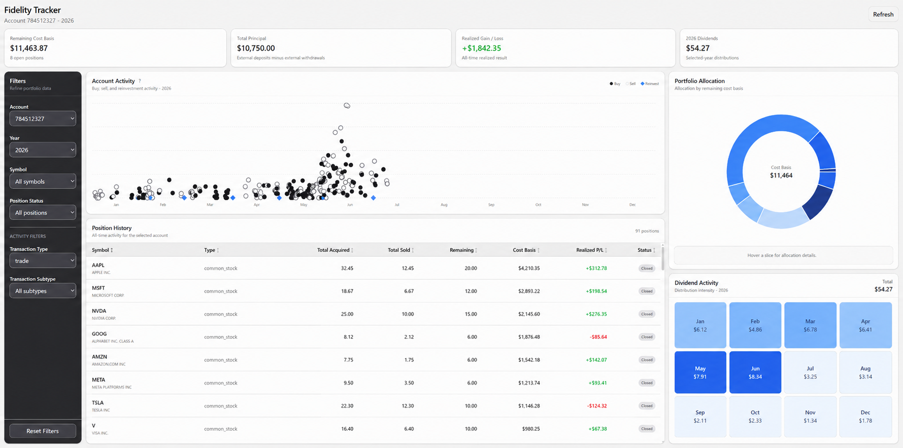

# Fidelity Tracker

A self-hosted portfolio tracking application for analyzing Fidelity transaction history.

Fidelity Tracker processes exported Fidelity transaction CSV files, enriches security metadata, calculates portfolio statistics, and presents the results through an interactive dashboard. The application is designed for local use and does not require a database.

## Dashboard Preview

<p align="center">
  
</p>

<p align="center">
  <em>Demo screenshot with anonymized account information and modified financial values.</em>
</p>

## Features

- Import Fidelity transaction history from CSV
- Clean, classify, validate, and enrich transaction records
- Resolve security identifiers and metadata with OpenFIGI
- Track open and closed positions
- Calculate remaining cost basis and realized gain/loss
- Summarize dividend and distribution activity
- Review account activity and transaction history
- Filter by account, year, symbol, position status, and transaction type
- Explore security-level transaction history
- Store transaction data locally without requiring a database

## Tech Stack

### Frontend

- React
- Vite
- JavaScript
- Tailwind CSS
- shadcn/ui
- Recharts

### Backend

- Python
- FastAPI
- pandas

### External Services

- OpenFIGI API for security identifier resolution and metadata enrichment

### Local Orchestration

- Docker
- Docker Compose

## Architecture

```text
Fidelity CSV Exports
        ↓
Data Preprocessing
        ↓
Security Metadata Enrichment
        ↓
Portfolio Aggregation
        ↓
FastAPI
        ↓
React Dashboard
```

The backend preprocesses transaction data when the application starts and exposes portfolio data through REST API endpoints. The frontend consumes those endpoints to provide portfolio summaries, filters, charts, and transaction-level views.

## Local Data Storage

Fidelity Tracker does not require a database.

Transaction exports are read directly from local CSV files. Generated security metadata and preprocessing logs are also stored locally and mounted into the Docker environment.

This keeps setup lightweight and avoids requiring users to:

- install or configure a database server
- create database tables
- run SQL migrations
- upload full transaction history to an external storage service

OpenFIGI is used only for security identifier and metadata resolution.

## Getting Started

### 1. Install Docker

Install Docker with Docker Compose support.

### 2. Add Fidelity transaction data

Export your Fidelity transaction history and place the CSV files in the project's `data/` directory.

### 3. Optional: configure OpenFIGI

Fidelity Tracker can use OpenFIGI without an API key. If you have one, copy `.env.example` to `.env` and add the key:

```text
OPENFIGI_API_KEY=your_key_here
```

Do not commit `.env`, transaction exports, account information, or other private financial data.

### 4. Start Fidelity Tracker

From the project root:

```bash
docker compose up --build
```

Docker Compose builds and starts both the FastAPI backend and React frontend. The frontend is built with Vite and served from its container.

Open the dashboard at:

```text
http://localhost:5173
```

To stop the application:

```bash
docker compose down
```

After the initial build, later starts can usually use:

```bash
docker compose up
```

## Intended Workflow

1. Export transaction history from Fidelity.
2. Place the CSV files in the `data/` directory.
3. Run `docker compose up --build`.
4. The backend loads, cleans, classifies, validates, and enriches the transactions.
5. Portfolio statistics are calculated and exposed through the local API.
6. The frontend displays the processed portfolio data.

## Project Structure

```text
Fidelity_Tracker/
├── backend/
│   ├── api/
│   ├── pipeline/
│   ├── services/
│   └── Dockerfile
├── frontend/
│   ├── src/
│   └── Dockerfile
├── data/
├── metadata/
├── logs/
├── compose.yaml
├── requirements.txt
└── README.md
```

## Privacy

Fidelity Tracker is intended to be self-hosted.

Portfolio transaction files remain on the machine running the application. The `data/` directory is mounted read-only into the backend container, while generated metadata and logs are persisted locally.

External API usage is limited to security identifier and metadata resolution rather than storing full transaction history remotely.

## Disclaimer

Fidelity Tracker is an independent project and is not affiliated with, endorsed by, or sponsored by Fidelity Investments.

The application is intended for personal portfolio analysis and should not be considered financial, tax, or investment advice.
